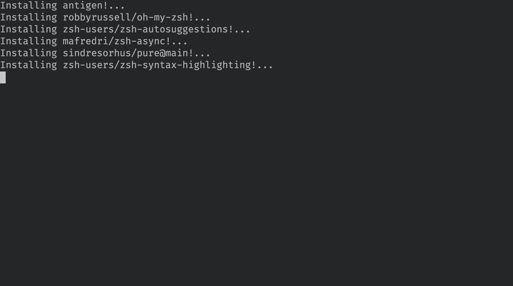

+++
title = "A Better Shell Prompt"
+++

Date: 2021-04-04

I have spent much of time at the command line. Typing in commands, navigating through folders, tab completing,
getting annoyed when I hear the "bell" sound because the tab complete is invalid and I didn't turn off that annoying
option in the terminal emulator yet. When I first started using the cli, it felt different. It felt awkward. Typing in
commands instead of selecting from a menu, having to remember all those options and the order they went in. I've been
using the linux shell now for so long that its mainly muscle memory for me at this point.

Looking back almost 10 years now, there is much I could have done to customize my shell and improve my usage of it.
Overtime I've tried many different shells, terminal emulators, terminal multiplexers, utility replacements, etc.
I think I have extracted enough of the good parts to have what I feel is a better default.

Its prompt is minimal and its features are very useful and so self explanatory I have never had to explain it to a user.
In short, this is [zsh](https://en.wikipedia.org/wiki/Z_shell) with the
[pure theme](https://github.com/sindresorhus/pure) and a few custom antigen plugins.

## Installation

Thanks to [antigen](https://github.com/zsh-users/antigen) (a package manager for zsh plugins) settings this up can be
done by simply copying the following to the start of your `.zshrc`.

```bash
# Install antigen if not found. 
# https://github.com/zsh-users/antigen
# You can uninstall antigen with
#   rm -rf $HOME/.antigen*
ANTIGEN_FILE="$HOME/.antigen.zsh"
if [ ! -f "$ANTIGEN_FILE" ]; then
    echo "Installing antigen!..."
    curl -sL git.io/antigen > "$ANTIGEN_FILE"
fi

# Load antigen
source "$ANTIGEN_FILE"
antigen use oh-my-zsh

# Git status arrows in the shell prompt
antigen bundle git

# Auto-suggest lookup https://github.com/zsh-users/zsh-autosuggestions
antigen bundle zsh-users/zsh-autosuggestions

# Use pure theme https://github.com/sindresorhus/pure
antigen bundle mafredri/zsh-async
antigen bundle sindresorhus/pure@main

# Syntax highlighting
antigen bundle zsh-users/zsh-syntax-highlighting

# Apply antigen settings
antigen apply
```

When you open a new zsh shell you will see something like the following only once.
I also type some commands demonstrating the syntax highlighting and auto complete.



## You're Done

Thats it. The "installation" of antigen is managed all in the `.zshrc` itself making this setup very
portable. Hopefully your experience at the command line will be a little smoother now.

If you don't like these changes, then remove the code you added to your `~/.zshrc` and run

```bash
rm -rf $HOME/.antigen*
```

## Extras

If you like this suggestion, you may also be interested in the following projects

* **[exa](https://github.com/ogham/exa)** - A better, colorful `ls`.
* **[trash-cli](https://github.com/sindresorhus/trash-cli)** - Stop *removing* files with rm and just move them to the
  trash. Also made by the creator of the pure theme.
 
## References

* [https://github.com/ogham/exa](https://github.com/ogham/exa)
* [https://github.com/sindresorhus/pure](https://github.com/sindresorhus/pure)
* [https://github.com/zsh-users/antigen](https://github.com/zsh-users/antigen)
* [https://github.com/zsh-users/zsh-autosuggestions](https://github.com/zsh-users/zsh-autosuggestions)
